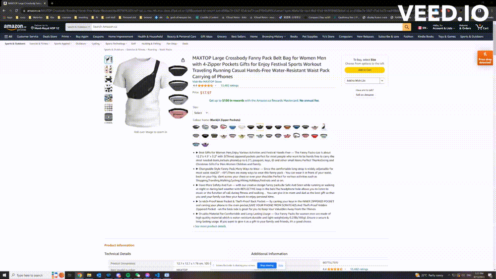
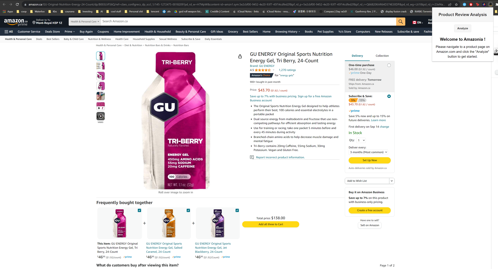
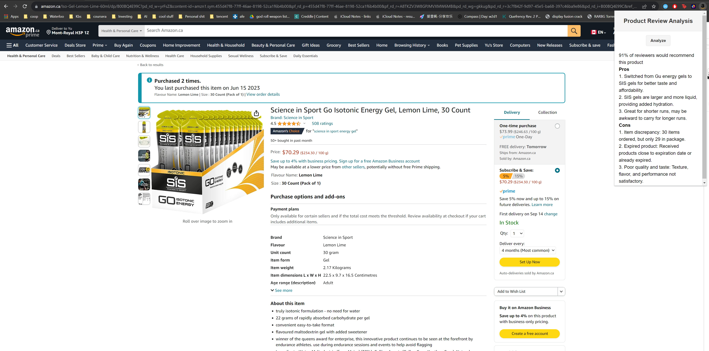

# Amazonia: Amazon Review Helper

## Description
Welcome to Amazonia! This is a web-based application that allows Amazon customers to quickly view concise product reviews. The application is built using the Flask and Node.js framework.



## Installation
1. Clone the repository
2. Install the dependencies

**Python**
```
cd python
pip install -r requirements.txt
```
**Javascript**
```
cd javascript
npm install
```

3. Run the application
**Python**
```
cd python
python pyserver.py
```
**Javascript**
```
cd javascript
npm run start
```

For the Chrome extension, please visit this guide for installation instructions: https://support.google.com/chrome_webstore/answer/2664769?hl=en 

## Usage
Visit any Amazon product page, and click the Amazonia extension icon. Then, click "Analyze" to start the analysis

## Demo
Welcome page


Review Analysis


## Technology
### Chrome Extension
I used a mixture of Javascript scripts, HTML and CSS to create the page. The extension is built using the Chrome Extension API. The extension is able to communicate with the Node.js server using the Fetch API.

### Backend
#### Infra
I used Node.js and Puppeteer.js to scrape the Amazon product page, which is then sent to the Flask backend for sentiment analysis and summarization.

#### Machine Learning
I used the OpenAI framework to send requests to the GPT-3 API for summarization. For the sentiment anslysis, I used this Huggingface model: https://huggingface.co/nlptown/bert-base-multilingual-uncased-sentiment

